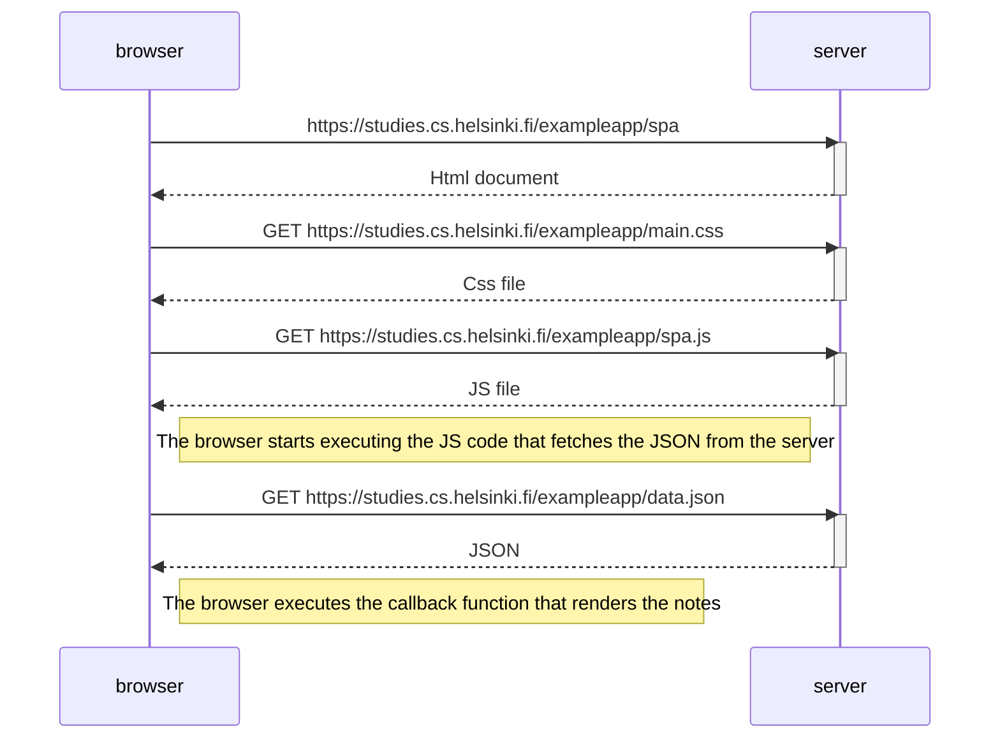

```mermaid
sequenceDiagram

    participant browser
    participant server

    browser->>server:https://studies.cs.helsinki.fi/exampleapp/spa
    activate server
    server-->>browser: Html document
    deactivate server


    browser->>server: GET https://studies.cs.helsinki.fi/exampleapp/main.css
    activate server
    server-->>browser: Css file
    deactivate server

    browser->>server: GET https://studies.cs.helsinki.fi/exampleapp/spa.js
    activate server
    server-->>browser: JS file
    deactivate server


    Note right of browser: The browser starts executing the JS code that fetches the JSON from the server
    browser->>server: GET https://studies.cs.helsinki.fi/exampleapp/data.json

    activate server
    server-->>browser: JSON
    deactivate server
    Note right of browser: The browser executes the callback function that renders the notes


```
