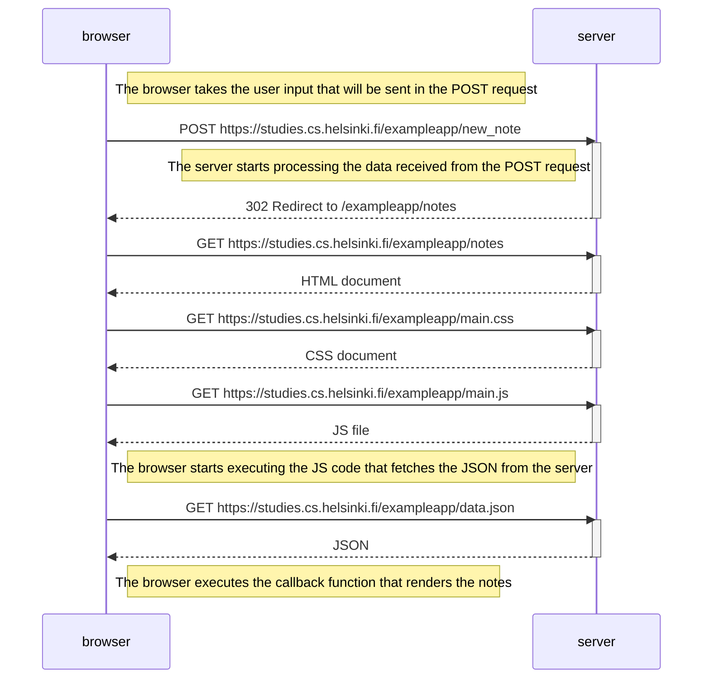

```mermaid
sequenceDiagram

    participant browser
    participant server

    Note right of browser: The browser takes the user input that will be sent in the POST request
    browser->>server: POST https://studies.cs.helsinki.fi/exampleapp/new_note
    activate server
    Note left of server: The server starts processing the data received from the POST request
    server-->>browser: 302 Redirect to /exampleapp/notes
    deactivate server

    browser->>server: GET https://studies.cs.helsinki.fi/exampleapp/notes
    activate server
    server-->>browser: HTML document
    deactivate server

    browser->>server: GET https://studies.cs.helsinki.fi/exampleapp/main.css
    activate server
    server-->>browser: CSS document
    deactivate server

    browser->>server: GET https://studies.cs.helsinki.fi/exampleapp/main.js
    activate server
    server-->>browser: JS file
    deactivate server

    Note right of browser: The browser starts executing the JS code that fetches the JSON from the server
    browser->>server: GET https://studies.cs.helsinki.fi/exampleapp/data.json
    activate server
    server-->>browser: JSON
    deactivate server
    Note right of browser: The browser executes the callback function that renders the notes


```
